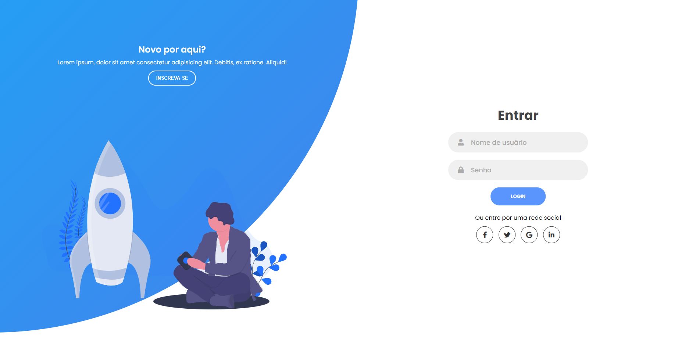

  

  Projeto para login e registro de usuários

  

  <a href="#clipboard-sobre-o-projeto">Sobre o Projeto</a>&nbsp;&nbsp;&nbsp;|&nbsp;&nbsp;&nbsp;
  <a href="#computer-tecnologias-utilizadas">Tecnologias</a>&nbsp;&nbsp;&nbsp;|&nbsp;&nbsp;&nbsp;
  <a href="#closed-book-licença">Licença</a>

## :clipboard: Sobre o Projeto

Página de login e registro rentável com elementos voltados para um registro fácil e confortável para o usuário. Ela também vem acompanhada de um design moderno e totalmente flexível para qualquer tipo de aparelho!

## :computer: Tecnologias utilizadas

O projeto foi desenvolvido utilizando as seguintes tecnologias:

- HTML
- CSS
- JavaScript

## :closed_book: Licença

Esse projeto está sob a licença MIT.